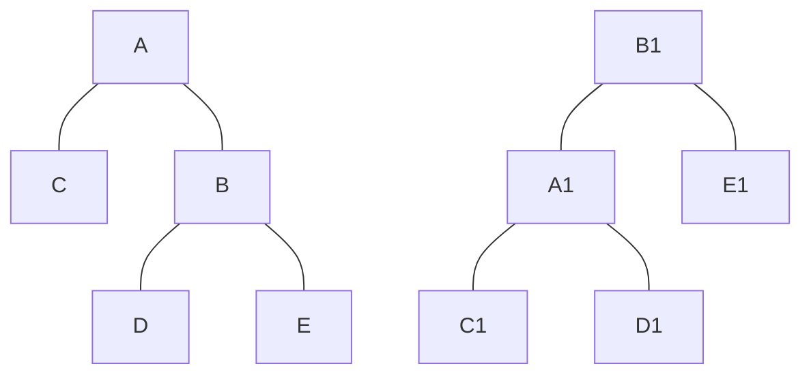
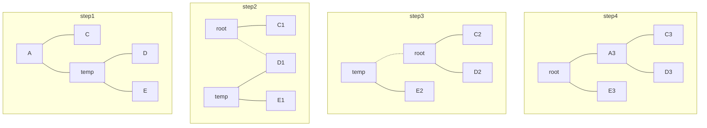
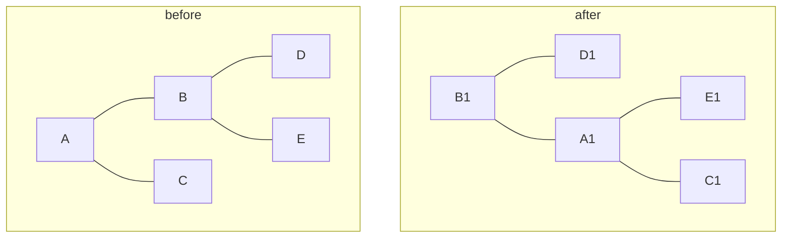
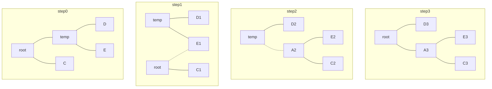
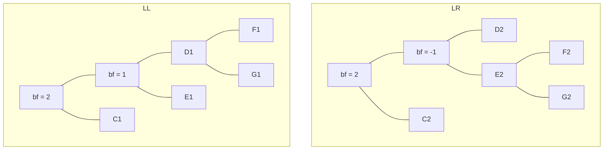
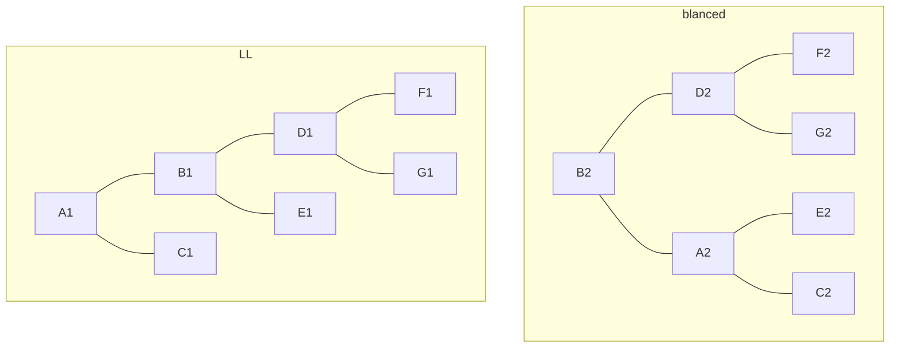
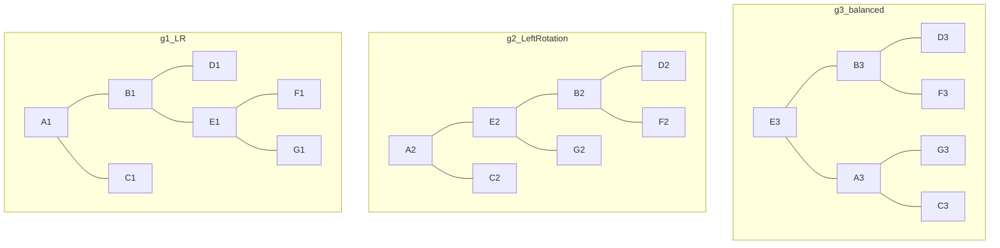
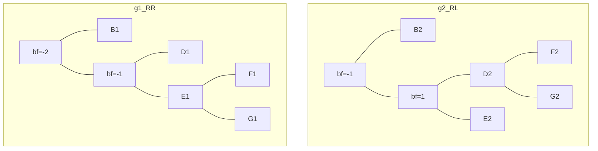
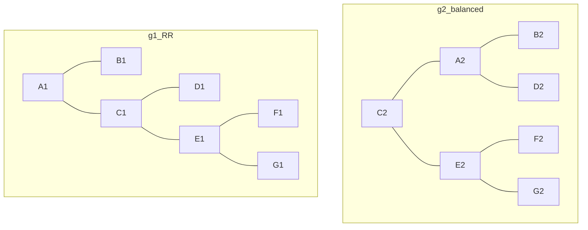
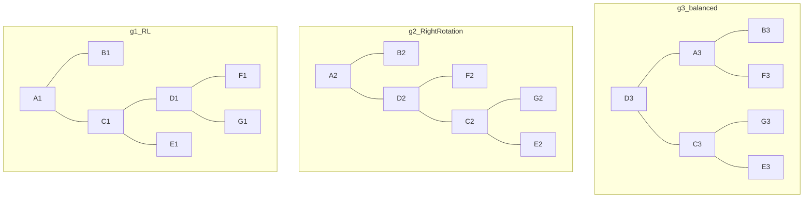

<!--
 * @Copyright: https://github.com/yangjam-cn/algorithm
 * @File name: AVL
 * @Description: 二叉平衡树
   * vscode编辑
   * 依赖插件：Markdown Preview Mermaid Support（支持mermai绘图）
   * 依赖插件：Markdown Preview Enhanced（md文件预览）
 * @Author: yangjam
 * @Version: demo
 * @Date: 2020-07-24 19:43:26
 * @History: 修改历史列表，每条修改记录应包括修改日期、修改者及修改内容简述
 * @LastEditTime: 2020-07-25 17:06:40
--> 
# AVL树
* AVL树仍然是二叉搜索树，对任意结点，其左右子树的高度之差的绝对值不超过1，其左右子树的的高度之差称为该结点的平衡因子
* 树的高度在每次插入元素后仍然能保持$O(\log{n})$的级别，查询操作的复杂度仍然是$O(\log{n})$
## 结点定义
* 结点定义
```cpp
struct node
{
  int value;     /* 数据域 */
  int height;    /* 当前子树高度 */
  node *lchild;
  node *rchild;
};
/* 空结点高度为0 */
/* 非空结点高度初始化为1 */
```
* 计算根结点平衡因子
```cpp
int getBalanceFactor(node *root)
{
  return getHeight(root->lchild) - getHeight(root->rchild);
}
```
* 更新根结点的高度
```cpp
void updateHeight(node *root)
{
  root->height = max(getHeight(root->lchild), getHeight(root->rchild)) + 1;
}
```
* 查找操作
```cpp
void search(node *root, int x)
{
  if (root == nullptr)
  {
    printf("search failed!\n");
    return;
  }
  if (x == root->data)
  {
    printf("%d\n", root->data);
  }
  else if (x < root->data)
  {
    search(root->lchild, x);
  }
  else
  {
    search(root->rchild, x);
  }
}
```
## 平衡操作
### `左旋(left rotation)`

* 如左图C< A < D < B < E,将根结点从A变为B，则改变后如右图所示
  * 改变1，B的左分支成为A的右分支
  * 改变2，A成为B的左分支
  * 改变3，B成为根结点
* 实现过程如图所示

* 算法描述
  * 建立临时变量(temp)保存根节点的右分支结点(即新根节点B)
  * 让新根结点(B)的左子树(D)成为原根节点(A)的右子树
  * 让原根节点(A)成为新根节点(B)的左子树
  * 将根结点(B)设为新根节点
```cpp
void left_rotation(node* &root)
{
  node *temp = root->rchild;
  root->rchild = temp->lchild;
  temp->lchild = root;
  /* 子树不改变，根的高度不变，故只需要更新原根与新根的高度 */
  update_height(root);
  update_height(temp);
  root = temp;
}
```
### `右旋(right rotation)`

* 如图所示，D < B < E < A < C，右旋操作后如右图所示
  * 改变1，B的左子树成为A的右子树
  * 改变2，A成为B的右子树
  * 改变3，B成为根结点
* 实现过程如图所示

* 算法过程描述
  * 创建临时变量保存新根结点(B)
  * 让新根节点(B)的右子树成为原根结点(A)的左子树
  * 让原根节点(A)成为新根节点(B)的右子树
  * 更新根节点为新根节点(B)
```cpp
void right_rotation(node* &root)
{
  node *temp = root->lchild;
  root->lchild = temp->rchild;
  temp->rchild = root;
  update_height(root);
  update_height(temp);
  root = temp;
}
```
### 失衡分析
* 假定有一棵二叉平衡树，在向其中插入一个结点时，一定会有结点的平衡因子发生改变
  * 插入位置已有兄弟结点，则只改变其父节点平衡因子，且平衡因子减小
  * 插入位置没有兄弟结点，则父节点及祖父结点平衡因子也加1，此时祖父结点可能失衡
* 只有从根节点到该插入结点的路径上的结点才可能发生平衡因子改变
* 只要把最靠近插入结点的失衡结点调整正常，路径上所有结点就都会平衡
* 假设最靠近插入结点的失衡结点为A，则它的失衡因子只可能是2或-2
* bf=2的情况

  * 对LL型进行平衡，可将以D1为根的子树视为整体，以A1作为root进行右旋

  * 对LR型则先忽略A2结点，对以节点B2为根的子树进行左旋，则树转换为LL型，再对A2结点进行右旋

* bf = -2的情况

  * 对于RR型，只需要对A1结点进行左旋即可

  * 对于RL型，对C2结点进行右旋变为RR型，然后对A2进行左旋

* AVL树插入情况汇总表(BF表示平衡因子)

|树型|判定条件|调整方法|
|:-:|:-----|:------|
|LL|BF(root)=2,BF(root->lchild)=1|对root进行右旋|
|LR|BF(root)=2,BF(root->lchild)=-1|对root->lchild进行左旋，再对root进行右旋|
|RR|BF(root)=-2,BF(root->rchild)=-1|对root进行左旋|
|RL|BF(root)=-2,BF(root->rchild)=1|对root->rchild进行右旋，再对root进行左旋|
