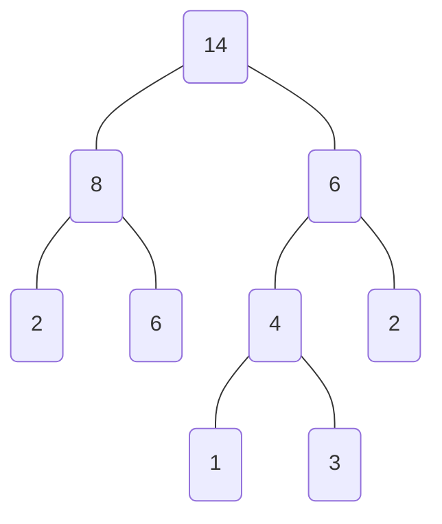

<!--
 * @Copyright: https://github.com/yangjam-cn/algorithm
 * @File name: 哈夫曼树
 * @Description: 哈夫曼树
 * @Author: yangjam
 * @Version: demo
 * @Date: 2020-07-27 21:25:18
 * @History: 修改历史列表，每条修改记录应包括修改日期、修改者及修改内容简述
 * @LastEditTime: 2020-07-27 21:54:45
--> 
# 哈夫曼树
## 果子合并问题
    有n堆果子，每堆果子的质量已知，现在需要把这些果子合并成一堆，但是每次只能把两堆果子合并在一起，同时会消耗与两堆果子质量之和等值的体力。请设计合并的次序方案，使得消耗的体力最少，并给出消耗的体力值。
* 假设有三堆果子，质量依次为1，2， 9，先合并1和2，消耗体力为1+2=3，在合并9，消耗体力为3+9=12，总消耗为12+3=15
* 不妨把每堆果子视为结点，果堆的质量视为权值，这样合并果堆的过程可以视为生成一个父结点，且父结点的权值等于它们的质量之和，则将n堆果子合并成一堆可以用一棵树来表示

* 如树所示，消耗的总体力为：8+4+6+14=32
* 同时，总消耗也可以通过把叶子结点的权值乘以各自的路径长度求和获得$2*2+6*2+1*3+3*3+2*2=32$
* 叶子结点的权值乘以其路径长度的结果称为这个叶子结点的`带权路径长度`，树的带权路径长度`(Weighted Path Length of Tree, WPL)`等于所有叶子结点的带权路径长度之和
* 故果子问题转化为：`已知n个数，寻找一棵树，使得树的所有叶子结点的权值恰好为这n个数，并且使得这棵树的带权路径长度最小`
* 带权路径长度最小的树称为`哈夫曼树(最优二叉树)`
* 对于同一组叶子结点来说，哈夫曼树可以不唯一，但是最小带权路径长度一定是唯一的
* 构造方法
  * 初始状态下，有n个结点，将它们视为n棵只有一个结点的树
  * 合并其中根结点权值最小的两棵树，生成两棵树的父结点，权值为这两个根结点的权值之和
  * 重复上述操作，直到只剩下一颗树为止，该树为哈夫曼树