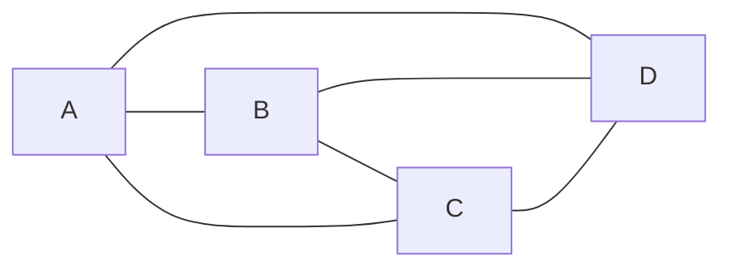
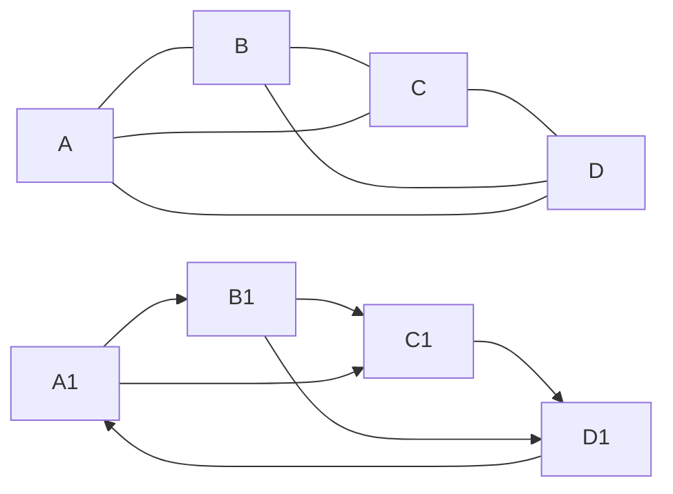
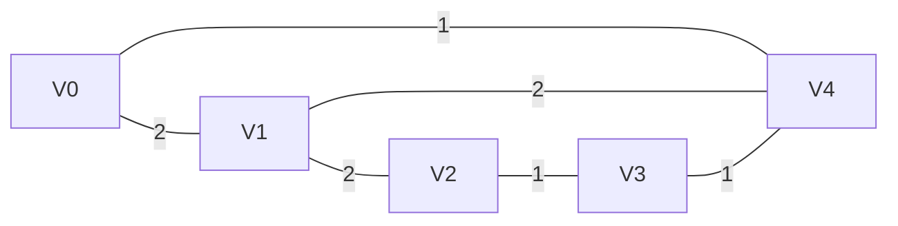
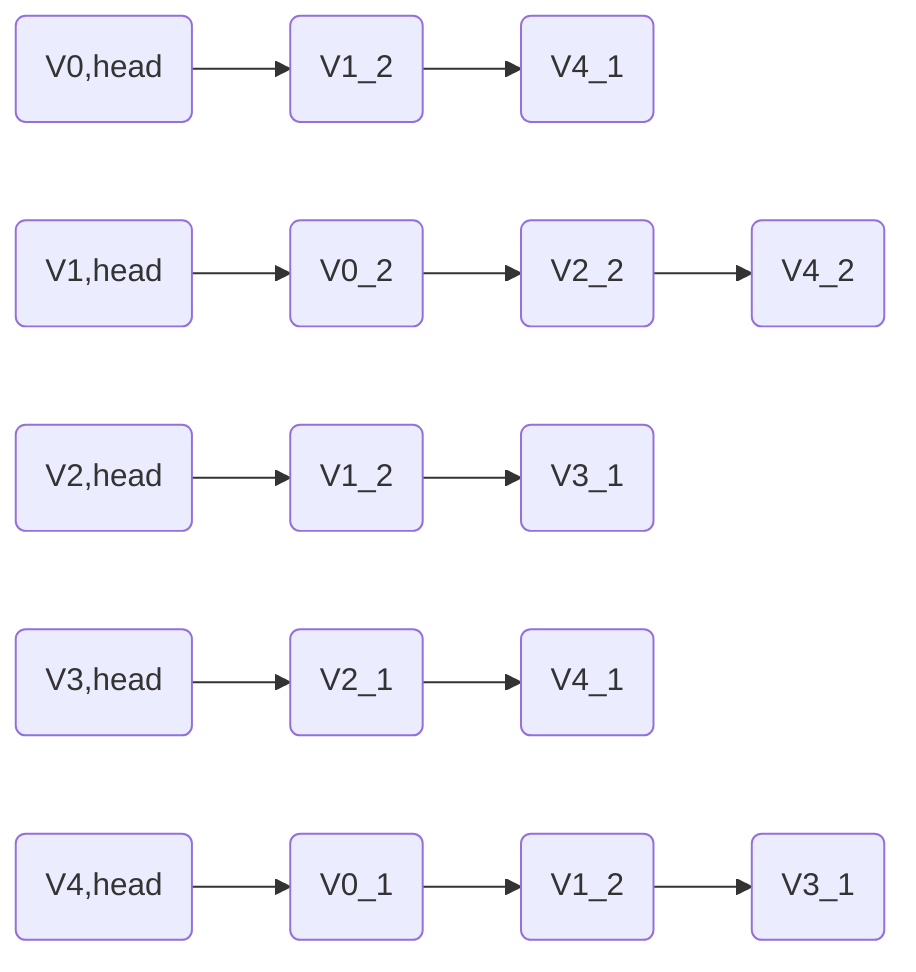
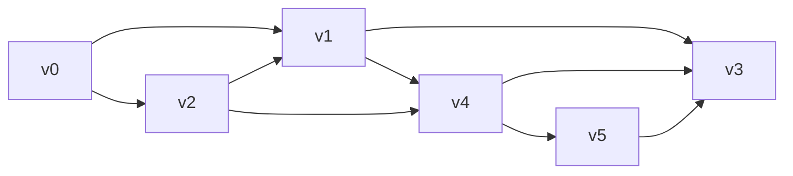
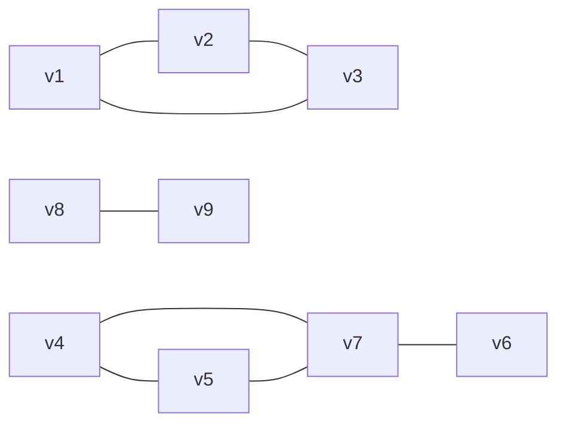
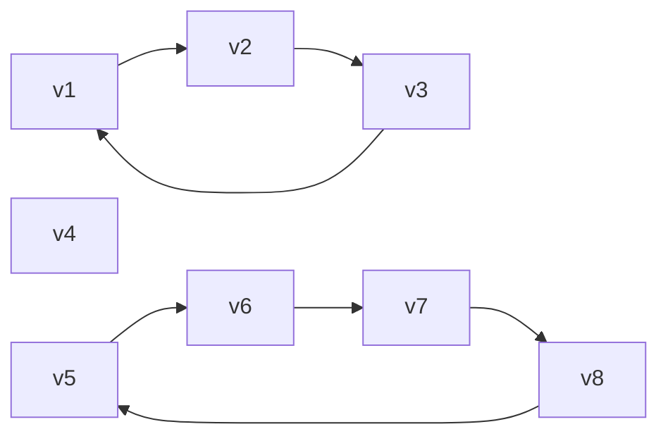

<!--
 * @Copyright: https://github.com/yangjam-cn/algorithm
 * @File name: 文件名
 * @Description: 
 * @Author: yangjam
 * @Version: demo
 * @Date: 2020-07-28 08:53:39
 * @History: 修改历史列表，每条修改记录应包括修改日期、修改者及修改内容简述
 * @LastEditTime: 2020-07-28 21:23:17
--> 
# 图的定义及相关术语

* 图由`顶点(Vertex)`和`边(Edge)`组成，每条边的顶点必须是图的两个顶点(可以是相同顶点)，记号G(V,E)表示图G的顶点集为V，边集为E
* 图分为`有向图`和`无向图`
  * 有向图确定了顶点到顶点的指向
  * 无向图的所有边都是双向的，可以当作所有边都是正向和负向的两条有向边组成

* 顶点的`度`是指和该顶点相连的边的条数
  * 对有向边而言，顶点的出边数成为顶点的`出度`，入边数称为`入度`
* 顶点和边都可以有一定的属性，称为`权值`，顶点的权值和边的权值分别称为`点权`和`边权`
# 图的存储
## 邻接矩阵
* 设图G(V,E)的顶点标号为0，1，...，N-1，那么令二维数组G[N][N]的两维分别表示图的顶点标号，即如果G[i][j]=1，则说明顶点i和j之间有边；如果G[i][j]=0，则说明顶点i和j之间不存在边，该二维数组称为`邻接矩阵`

* 上图邻接矩阵如下图所示，边权可使用G[i][j]存放，不存在的边可以设边权为0、-1或很大的数
  * 对于无向图，邻接矩阵是一个对称矩阵
$$
\left[
    \begin{array}{ccc}
    0 & 2 & 0 & 0 & 1 \\
    2 & 0 & 2 & 0 & 2 \\
    0 & 2 & 0 & 1 & 0 \\
    0 & 0 & 1 & 0 & 1 \\
    1 & 2 & 0 & 1 & 0
    \end{array}
\right]
$$
## 邻接表
* 设图G(V,E)的顶点编号为0~N-1，每个顶点都可能有若干条出边，如果把同一个顶点的所有出边放在一个列表中，那么n个顶点对应n个列表(没有出边对应空表)，这个表称为图G的`邻接表`

* 可以使用vector简单实现
```cpp
vector<int> Adj[N];     /* 定义邻接表(只存放终点编号) */   
Adj[1].push_back(3);    /* 向1好顶点添加到3号顶点的边 */

/* 带权边 */
struct node
{
    int v;    /* 边的终点编号 */
    int w;    /* 边权 */
};
vector<node> Adj[N];
node temp;
temp.v = 3;
temp.w = 4;
Adj[1].push_back(temp);

/* 通过结构体构造函数创建结点 */
struct node
{
    int v, w;
    node(int _v, int _w) : v(_v), w(_W) {}    /* 构造函数 */
}
Adj[1].push_back(node(3, 4));
```
# 图的遍历
## 深度优先搜索(DFS)
### DFS遍历图

* 每次沿着路径到不能再前进时才退回到最近的岔路口
  * 访问v0，从v0出发，可以访问两个未访问顶点v1和v2
  * 访问v1，从v1出发，可以访问未访问顶点v3和v4
  * 访问v3，v3无法访问其它顶点，故退回到尚有未访问分支顶点的v1
  * 访问v4，从v4出发，可以访问未访问顶点v5
  * 访问v5，v3已访问，故v5无法访问未访问顶点，退回到距v5最近尚有未访问分支顶点的v0
  * 访问v2，此时所有顶点已访问，结束
### DFS的具体实现
* 连通分量
  * 在无向图中，如果两个顶点之间可以相互到达(可以是通过一定路径间接到达)，那么就称这两个顶点是连通的
  * 如果图G(V,E)中任意两个顶点都是连通，则称图G是连通图
  * 否则，称非连通图，且其中的极大连通子图称为连通分量
* 强连通分量
  * 在有向图中，如果两个顶点可以各自通过一条有向路径到达另一个顶点，就称这两个顶点强连通
  * 如果图G(V,E)任意两个顶点都强连通，则称图G为强连通图
  * 否则，称非强连通图，且其中极大强连通子图称为强连通分量
* 无向图连通分量示意图

* 有向图强连通分量示意图

* 对图的遍历就是遍历所有连通块，伪代码如下
```cpp
DFS(u)                        /* 访问顶点u */
{
    vis[u] = true;            /* 标记u已访问 */
    for (从u出发能到达的所有顶点v)
        if vis[v] == false    /* v未被访问 */
            DFS(v);           /* 递归访问v */
}
DFSTrave(G)                   /* 遍历图G */
{
    for (G的所有顶点u)
        if vis[u] == false    /* u未被访问 */
            DFS(u);           /* 访问u所在连通块 */
}
```
```cpp
const int MAXV = 100;          /* 最大顶点数 */
const int INF = 0xFFFFFFFF;    /* 设INF为很大的数 */


/* 邻接矩阵版 */
int n, G[MAXV][MAXV];          /* n为顶点数，G为图的邻接矩阵 */
bool vis[MAXV] = {false};      /* 标记顶点是否访问 */

/* u为当前访问顶点，depth为深度 */
void DFS(int u, int depth)
{
    vis[u] = true;             /* 设置u已被访问 */

    /* 
     * 执行对u的访问操作 
    */

    /* 对从u出发的可以到达的顶点进行枚举 */
    for (int v = 0; v < n; v++)
    {
        if (!vis[v] && G[u][v] != INF)    /* v未被访问且可到达 */
        {
            DFS(v, depth + 1);  /* 访问v，深度加1 */
        }
    }
}
/* 遍历图G */
void DFSTravse()
{
    for (int u = 0; u < n; u++) /* 对每个顶点u进行遍历 */
    {
        if (!vis[u])            /* 如u未被访问 */
        {
            DFS(u, 1);          /* 访问u及其连通块，1表示初始为第一层 */
        }
    }
}

/* 邻接表版 */
vector<int> Adj[MAXV];          /* 图的邻接表 */
int n;                          /* 顶点数 */
bool vis[MAXV] = {false};

void DFS(int u, int depth)
{
    vis[u] = true;

    /*
     * 对u执行操作
     */

    for (int i = 0; i < Adj[u].size(); i++)
    {
        int v = Adj[u][i];
        if (!vis[v])
        {
            DFS(v, depth + 1);
        }
    }
}

void DFSTrave()
{
    for (int u = 0; u < n; u++)
    {
        if (!vis[u])
        {
            DFS(u, 1);
        }
    }
}
```
## 广度优先搜索(BFS)
### 用BFS遍历图

* 采用队列结构实现BFS
  * 初始时将v0加入队列，此时队列仅有[v0]
  * 取出队首v0访问，将其可以直接访问且未加入队列的顶点v1、v2加入队列，此时队列为[v1,v2]
  * 取出队首v1访问，将其可以直接访问且未加入队列的顶点v3、v4加入队列，此时队列为[v2,v3,v4]
  * 取出队首v2访问，没有可以直接访问且未加入队列的顶点，跳过，此时队列为[v3,v4]
  * 取出队首v3访问，没有可以加入队列的顶点，跳过，此时队列为[v4]
  * 取出队首v4访问，将可以直接访问且为加入队列的顶点v5加入队列，此时队列为[v5]
  * 取出队首v5访问，没有可以加入队列的顶点，此时队列为[]
  * 队列为空，遍历结束
### BFS具体实现
* 伪代码
```cpp
DFS(u)
{
    queue q;          /* 定义队列 */
    inq[u] = true;    /* 标记入队元素 */
    while (q非空)
        取出队首元素并访问;
        for (从u出发可以到达的所有顶点v)
            if (!inq[v])
                将v入队;
                inq[v] = true;
}
BFSTrave()
{
    for (G的所有顶点u)
        if (!inq[u])
            BFS(u);
}
```
* 邻接矩阵版
```cpp
int n, G[MAXV][MAXV];
bool inq[MAXV] = {false};

void BFS(int u)
{
    queue<int> q;
    q.push(u);
    inq[u] = true;
    while (!q.empty())
    {
        int u = q.front();
        q.pop();
        for (int v = 0; v < n; v++)
        {
            if ((!inq[v]) && (G[u][v] != INF))
            {
                q.push(v);
                inq[v] = true;
            }
        }
    }
}
void BSFTravse()
{
    for (int u = 0; u < n; u++)
    {
        if (!inq[u])
        {
            BFS(u);
        }
    }
}
```
* 邻接表版
```cpp
vector<int> Adj[MAXV];
int n;
bool inq[MAXV] = {false};

void BFS(int u)
{
    queue<int> q;
    q.push(u);
    inq[u] = true;
    while (!q.empty())
    {
        int u = q.front();
        q.pop();
        for (int i = 0; i < Adj.size(); i++)
        {
            int v = Adj[u][i];
            if (!inq[v])
            {
                q.push(v);
                inq[v] = true;
            }
        }
    }
}
void BFSTravse()
{
    for (int u = 0; u < n; u++)
    {
        if (!inq[u])
        {
            BFS(u);
        }
    }
}
```
