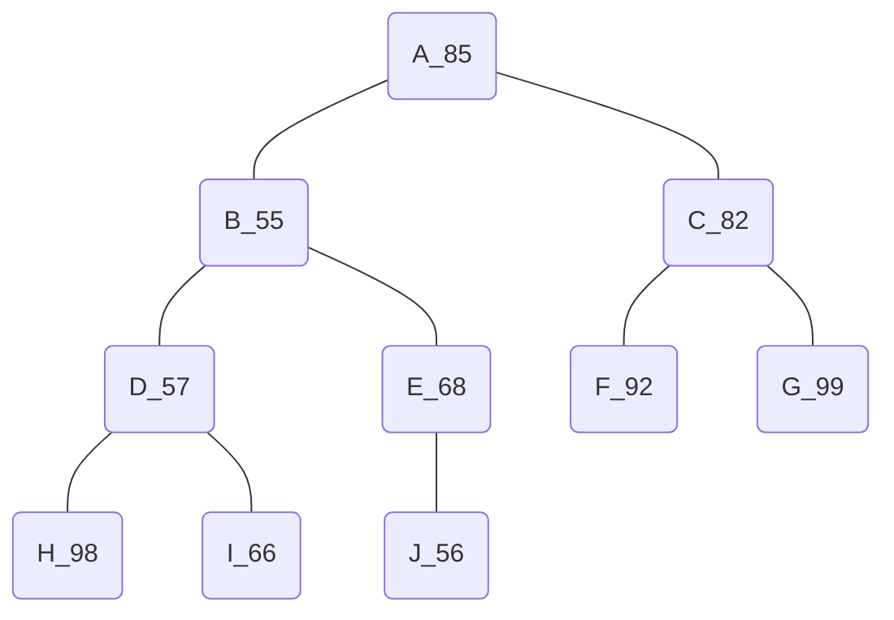
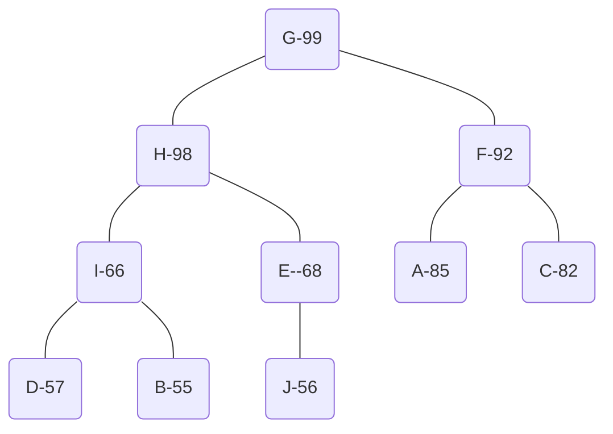

<!--
 * @Copyright: https://github.com/yangjam-cn/algorithm
 * @File name: 堆
 * @Description: 堆
 * @Author: yangjam
 * @Version: demo
 * @Date: 2020-07-27 17:00:23
 * @History: 修改历史列表，每条修改记录应包括修改日期、修改者及修改内容简述
 * @LastEditTime: 2020-07-27 21:04:32
--> 
# 堆的定义及基本操作
* 堆是一颗完全二叉树，树中的每个结点的值都不小于(或不大于)其左右孩子结点的值
  * 若父结点的值大于或等于孩子结点的值，那么称为`大顶堆`，此时每个结点的值都是以它为根结点的子树的最大值；
  * 若父结点的值小于或等于孩子结点的值，那么称为`小顶堆`，此时根结点为所在子树的最小值；
* 堆一般用优先队列实现
* 初始完全二叉树如下所示

* 转化方法：从下往上，从右往左，假设当前结点为x，则将x与他的子结点相比较，若存在比x大的结点，则交换两者位置(如D_57与H_98)，交换后x继续与下一级子结点比较，直到下一级都比它小或者没有下一级为止。
  * 从J开始，因为J、I、H、G、F均没有子结点，故跳过
  * E=68 > J=56，故无需交换
  * D=57 < max(H=98,I=66)，交换D与H
    * 交换后D无子结点，结束
  * C=82 < max(F=92,G=99)，交换G与C
  * B=55 < max(H=98,E=68)，交换B与H
    * B=55 < max(D=57,I=66), 交换B与I
  * A=85 < max(H=98,G=99)，交换A与G
    * A=85 < max(F=92,C=82)，交换A与F
  * 遍历结束

* 对于完全二叉树来说，比较简单的实现方法为使用数组
  * 根结点存储在数组的1号为，则数组i号位的左孩子则是2i号位
```cpp
const int maxn = 100;
int heap[maxn], n = 10;    /* heap为堆，n为元素个数 */
```
* 对完全二叉树进行建堆就是对父结点向下调整的过程
```cpp
/* 
 * 对heap数组在[low, high]范围进行向下调整
 * low为欲调整结点下标，high为堆的最后一个元素下标
*/
void downAdjust(int low, int high)
{
    int i = low, j = 2 * i;    /* i为欲调整结点，j为其左孩子 */

    while (j <= high)          /* 存在孩子结点 */
    {
        /* 如果存在右孩子且右孩子的值大于左孩子 */
        if (j + 1 <= high && heap[j + 1] > heap[j])
        {
            j = j + 1;         /* j存储右孩子下标 */
        }
        if (heap[j] > heap[i])         /* 孩子中最大值比欲调整结点值大 */
        {
            swap(heap[j], heap[i]);    /* 交换权值 */
            i = j;             /* 保持i为欲调整结点，j为i的左孩子 */ 
            j = 2 * i;
        }
        else
        {
            break;
        }
    }
}
```
* 建堆过程，只需要遍历从后往前遍历即可。假设序列元素个数为n，由于完全二叉树的叶子结点个数为$\lceil n/2 \rceil$，因因此数组下标在$[1, \lfloor n/2 \rfloor]$范围内的都是非叶子结点
```cpp
void create_heap()
{
    for (int i = n / 2; i >= 1; i++)
    {
        downAdjust(i, n);
    }
}
```
* 删除堆顶元素，并让其任然保持堆的结构，只需要让最后一个元素覆盖堆顶元素，让后对根结点调整即可
```cpp
void delete_top()
{
    heap[1] = heap[n--];
    downAdjust(1, n);
}
```
* 向堆里添加元素，可以将元素放在最后，然后进行向上调整。将欲调整结点与父结点比较，如果权值大于父结点，则交换位置，直到到达堆顶或者小于父结点权值为止。
```cpp
void upAdjust(int low, int high)
{
    int i = high, j = i / 2;

    while (j >= 1)
    {
        if (heap[j] < heap[i])
        {
            swap(heap[j], heap[i]);
            i = j;
            j = i / 2;
        }
        else
        {
            break;
        }
    }
}
void insert(int x)
{
    heap[++n] = x;
    upAdjust(1, n);
}
```
# 堆排序
* 使用堆结构对一个序列进行排序
* 对于堆来说，堆顶元素是最大的，因此建堆完成后，堆排序的直观思想就是，取出堆顶元素，然后将堆的最后一个元素替换成堆顶，再进行一次针对堆顶的向下调整，重复直到堆中只剩下一个元素为止
* 具体实现时，为了节省空间，可以倒着遍历数组，假设当前访问到i号位，那么将堆顶元素与i号位的元素交换，接着在[1, i-1]的范围内进行一次向下调整
  * 如[-,99, 98, 92, 66, 68, 85, 82, 57, 55, 56]
  * swap(99, 56)=>[-, 56,......, 99]
  * down(1, 9)=>[-, 98, 68, 92, 66, 56, 85, 82, 57, 55, 99]
  * swap(98, 55)=>[-, 55,......, 98, 99]
  * down(1, 8)=>[-, 92, 68, 85, 66, 56, 55, 82, 57, 98, 99]
  * swap(92, 57)=>[-, 57,......, 92, 98, 99]
  * down(1, 7)=>[-, 85, 68, 82, 66, 56, 55, 57, 92, 98, 99]
  * swap(85, 57)=>[-, 57,......, 85, 92, 98, 99]
  * down(1, 6)=>[-, 82, 68, 57, 66, 56, 55, 85, 92, 98, 99]
  * ......

```cpp
void heap_sort()
{
    create_heap();
    for (int i = n; i > 1; i--)
    {
        swap(heap[i], heap[1]);
        downAdjust(1, i - 1);
    }
}
```