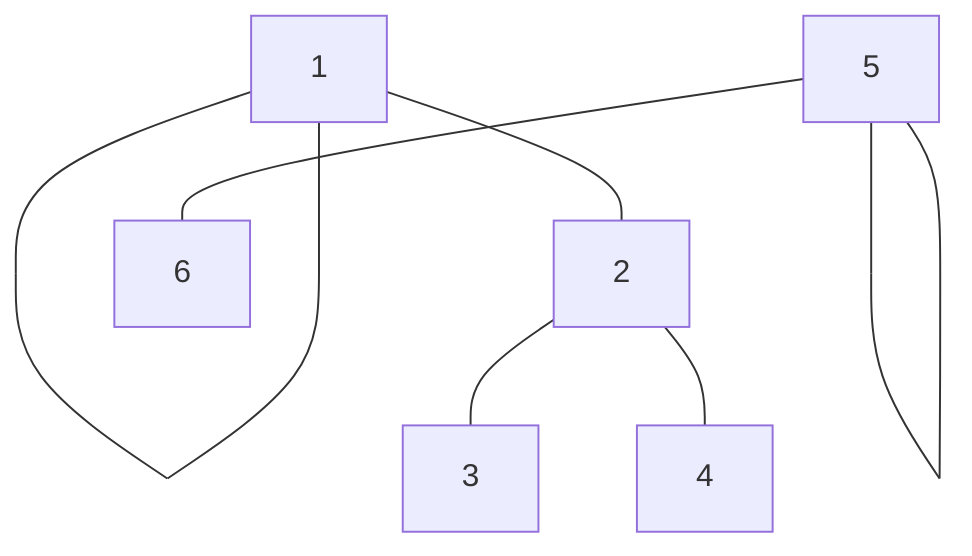

<!--
 * @Copyright: https://github.com/yangjam-cn/algorithm
 * @File name: 文件名
 * @Description: 并查集
 * @Author: yangjam
 * @Version: demo
 * @Date: 2020-07-27 09:57:50
 * @History: 修改历史列表，每条修改记录应包括修改日期、修改者及修改内容简述
 * @LastEditTime: 2020-07-27 15:40:30
--> 
# 并查集的定义
* 并查集是一种维护集合的数据结构，名字分别取自Union(合并)、Find(查找)、Set(集合)。支持如下两个操作
  * 合并：合并两个集合
  * 查找：判断两个元素是否在一个集合
* 并查集使用数组实现
```cpp
int father[N];
/* 
 * 其中father[i]表示元素i的父亲结点，而父亲结点本身也是这个集合内的元素(1<=i<=N) 
 * 如果father[i] = i，则说明元素i是该集合的根结点
*/
```
* 对于同一集合来说只存在一个根结点，且将其作为所属集合的标识
```cpp
father[1] = 1;    /* 1的父结点为1，即1为根结点 */
father[2] = 1;    /* 2的父结点为1 */
father[3] = 2;    /* 3的父结点为2 */
father[4] = 2;    /* 4的父结点为2 */
father[5] = 5;    /* 5的父结点为5，即5为根结点 */
father[6] = 5;    /* 6的父结点为5 */
/* 1, 5分别属于不同集合的根结点，标识不同的集合 */
```

# 并查集的基本操作
## 初始化
* 一开始，每个元素都是独立的集合，需要令所有father[i]=i
```cpp
for (int i = 1; i <= N; i++)
{
    father[i] = i;    /* 或令father[i] = -1 */
}
```
## 查找
* 规定同一个集合只存在一个根结点，因此查找操作就是对给定的节点寻找其根结点的过程
```cpp
int find_father(int x)
{
    while (x != father[x])
    {
        x = father[x];
    }
    return x;
}
/* 递归实现 */
int find_father(int x)
{
    if (x == father[x])
    {
        return x;
    }
    else
    {
        return find_father(father[x]);
    }
}
```
## 合并
* 合并是指把两个集合合并成一个集合，一般给出两个元素，要求把两个元素所在的集合合并
  * 先判断两个元素是否属于同一集合，只有不同集合才合并
  * 合并过程一般是把其中一个集合的根结点的父结点指向另一个集合的根结点
```cpp
void union_father(int a, int b)
{
    int faA = find_father(a);    /* 查找a的根结点 */
    int faB = find_father(b);    /* 查找b的根结点 */
    if (faA != faB)              /* 当不属于同一集合时才合并 */
    {
        father[faB] = faA;       /* 合并集合，将b所在集合的根指向a集合根 */
    }
}
```
* 并查集产生的的每一个集合都是一棵树
# 路径压缩
* 将链式转化为树型，把当前查询结点的路径上的所有结点的父亲都指向根结点
* 将查询平均复杂度O(n)的复杂度变为O(1)
  * 通过查找获取x的根结点r
  * 重新从x走一遍到r，把路径上所有结点的父结点改为根结点
```cpp
int find_father(int x)
{
    int a = x;    /* 保存x，用于回溯路径 */
    while (x != father[x])
    {
        x = father[x];
    }             /* 遍历到根结点结束 */

    while (a != father[a])
    {
        int z = a;        /* 保存子节点 */
        a = father[a];    /* 回溯父结点 */
        father[z] = x;    /* 修改父结点 */
    }
    return x;    /* 返回根结点 */
}
/* 递归实现 */
int find_father(int x)
{
    if (x == father[x])
    {
        return x;
    }
    else
    {
        int r = find_father(father[x]);
        father[x] = r;
        return r;
    }
}
```